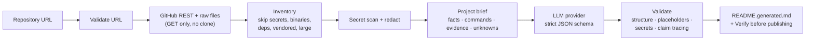

# repo2readme

**Turn any public GitHub repository into a polished README draft in one command, with every command, link, badge and license claim traced to the source or flagged for review.**

[](https://github.com/SM260845/repo2readme/actions/workflows/ci.yml)
[](LICENSE)


📖 **Project overview and walkthrough:** [the repo2readme gist](https://gist.github.com/SM260845/0b4b91ca78a570e858921828c651dad3)

Point `repo2readme` at a repository and pick a style: **professional**, **trendy**, **minimalist** or **comprehensive**. It reads a bounded set of high-signal files through the GitHub API, builds a structured, evidence-annotated project brief, and asks a text-generation model to write only what that brief supports. It then validates the result. Anything it can't trace back to the repository ends up in a **Verify before publishing** checklist instead of slipping through.

> [!IMPORTANT]
> repo2readme never clones, commits to, pushes to or otherwise changes the target repository. It writes `README.generated.md` in your current directory by default, so an existing README is never overwritten by accident. Always review the draft before you use it.

## Demo

The command below ran on 2026-09-28 against [`sindresorhus/is-plain-obj`](https://github.com/sindresorhus/is-plain-obj). It uses the **fixture provider, a deterministic template generator with no LLM involved**, so it shows exactly what the pipeline extracts and verifies. With a real model the prose is richer, and the same validation applies.

```sh
repo2readme https://github.com/sindresorhus/is-plain-obj --style trendy --dry-run --provider fixture
```

<details>
<summary>Generated README (fixture output)</summary>

````markdown
<!-- Generated by repo2readme from https://github.com/sindresorhus/is-plain-obj (style: trendy). Review every command, link, badge and license statement before publishing. -->

# is-plain-obj

## ✨ Highlights


> [!TIP]
> Check if a value is a plain object

## 📦 Installation

```sh
npm install is-plain-obj
```

## 🧑‍💻 Development

```sh
npm install
npm test
```

## 📄 License

Released under the MIT license. See [license](license).

## Verify before publishing

> [!IMPORTANT]
> repo2readme could not trace the items below to evidence in the repository. Check each one, then delete this section before publishing.

- [ ] **Badge** `https://img.shields.io/badge/license-MIT-blue` (line 7): generated badge; confirm the service and value are correct
````

</details>

`npm install is-plain-obj` and the license were traced to the repository (its readme and GitHub's license detection). The generated shields.io badge wasn't, so it was flagged. The repo's `.npmrc` was excluded as a potential secret and never fetched.

## Contents

- [Requirements](#requirements)
- [Install](#install)
- [GitHub Action](#github-action)
- [Quick start](#quick-start)
- [Styles](#styles)
- [GitHub token (optional)](#github-token-optional)
- [Generation provider](#generation-provider)
- [Options](#options)
- [Review workflow](#review-workflow)
- [Data handling](#data-handling)
- [How it works](#how-it-works)
- [Exit codes](#exit-codes)
- [Development](#development)
- [Roadmap](#roadmap)
- [Contributing](#contributing)
- [License](#license)

## Requirements

- Node.js 22 or newer
- An API key for an OpenAI-compatible chat-completions endpoint (xAI by default). See [Generation provider](#generation-provider).
- Optional: a `GITHUB_TOKEN` for higher GitHub rate limits

## Install

From npm (once published; see [#5](https://github.com/SM260845/repo2readme/issues/5)):

```sh
npm install --global repo2readme
```

Until then, install the prebuilt tarball attached to the [v0.2.0 release](https://github.com/SM260845/repo2readme/releases/tag/v0.2.0):

```sh
npm install --global https://github.com/SM260845/repo2readme/releases/download/v0.2.0/repo2readme-0.2.0.tgz
```

Or run it from a clone:

```sh
git clone https://github.com/SM260845/repo2readme.git
cd repo2readme
npm install        # also builds dist/ via the prepare script
npm link           # puts `repo2readme` on your PATH
```

Either way you get the `repo2readme` command.

> [!NOTE]
> `npm install --global github:SM260845/repo2readme` doesn't work, because npm's global git installs don't build TypeScript.

## GitHub Action

Generate a README draft in CI and download it as a workflow artifact. The CLI summary, including the verify checklist, is added to the job summary. The action needs only read access.

```yaml
name: Draft README
on: workflow_dispatch

permissions:
  contents: read

jobs:
  readme:
    runs-on: ubuntu-latest
    steps:
      - uses: SM260845/repo2readme@v0.2.0
        with:
          style: professional                     # professional | trendy | minimalist | comprehensive
          api-key: ${{ secrets.REPO2README_API_KEY }}
          # repo-url: https://github.com/owner/repo  # default: this repository
          # base-url: https://api.openai.com/v1      # default: https://api.x.ai/v1
          # model: gpt-4.1-mini                       # default: grok-4.6
          # provider: fixture                         # deterministic output, no API key needed
```

| Input | Default | Description |
| --- | --- | --- |
| `repo-url` | the current repository | Public repository to document |
| `style` | `professional` | Writing style |
| `output` | `README.generated.md` | Output path in the workspace |
| `provider` | `openai` | `openai` (real endpoint) or `fixture` (deterministic, no key) |
| `api-key` / `base-url` / `model` | (empty) | Passed to the CLI as `REPO2README_API_KEY` / `REPO2README_BASE_URL` / `REPO2README_MODEL` |
| `github-token` | `github.token` | Read-only GitHub API access |
| `upload-artifact` / `artifact-name` | `true` / `repo2readme-output` | Upload the result as an artifact |

Output: `path`, the absolute path of the generated file. See the [self-test workflow](.github/workflows/action-selftest.yml) for a working example.

## Quick start

Interactive:

```console
$ repo2readme
? GitHub repository URL: https://github.com/acme/widget
? Style: Professional
? Output path: README.generated.md
Analyzing repository acme/widget…
Generating Professional README with grok-4.6 via api.x.ai (key from REPO2README_API_KEY)…
Created README.generated.md
```

Non-interactive:

```sh
repo2readme https://github.com/acme/widget --style professional --output README.generated.md
```

Preview without writing a file (the README goes to stdout, progress and the summary go to stderr):

```sh
repo2readme https://github.com/acme/widget --style minimalist --dry-run > preview.md
```

## Styles

| Style | What you get |
| --- | --- |
| `professional` | A clear value proposition, restrained design and the standard technical sections. |
| `trendy` | Strong visual hierarchy, compact badges and callouts, and a modern, friendly tone. |
| `minimalist` | Only the essential sections, with short copy and little decoration. |
| `comprehensive` | Detailed setup, configuration, architecture, contribution and troubleshooting sections, wherever the repository has evidence for them. |

Every style follows the same rule: a section only appears when the repository has evidence for it.

## GitHub token (optional)

Anonymous access gets 60 GitHub API requests per hour. A typical run uses about 4 API requests; file contents come from `raw.githubusercontent.com`, which doesn't count against that limit. If you hit the limit, the error tells you when it resets. To raise the limit to 5,000 requests per hour, set a token:

```sh
export GITHUB_TOKEN=...   # classic token with no scopes, or fine-grained with "Public repositories (read-only)"
```

The token is only read from the environment. It is sent only to GitHub, as an `Authorization` header, and never printed or logged. repo2readme only makes `GET` requests. It has no code path that writes to GitHub.

## Generation provider

repo2readme calls any OpenAI-compatible `/chat/completions` endpoint and asks for a strict JSON-schema response (`title`, `sections[]`, `warnings[]`).

| Variable | Purpose | Default |
| --- | --- | --- |
| `REPO2README_API_KEY` | API key (takes precedence) | |
| `XAI_API_KEY` | Used if `REPO2README_API_KEY` is unset | |
| `OPENAI_API_KEY` | Used if neither of the above is set | |
| `REPO2README_BASE_URL` | Endpoint base URL; must be `https` (plain `http` is allowed only for `localhost`) | `https://api.x.ai/v1` |
| `REPO2README_MODEL` | Model name | `grok-4.6` |

To keep an OpenAI key from being sent to another vendor: when the only key set is `OPENAI_API_KEY` and `REPO2README_BASE_URL` is unset, repo2readme uses `https://api.openai.com/v1` with `gpt-4.1-mini`.

Examples:

```sh
# xAI (default)
export REPO2README_API_KEY=...            # or XAI_API_KEY

# OpenAI
export OPENAI_API_KEY=...
export REPO2README_MODEL=gpt-4.1          # optional

# Any OpenAI-compatible server (OpenRouter, a local gateway, ...)
export REPO2README_API_KEY=...
export REPO2README_BASE_URL=https://openrouter.ai/api/v1
export REPO2README_MODEL=some/model
```

The model must support `response_format: { type: "json_schema" }`. Keys are read only from the environment and never logged. If an error message from the provider echoes your key back, repo2readme redacts it.

## Options

```text
repo2readme [url] [options]

  -s, --style <style>     professional | trendy | minimalist | comprehensive
  -o, --output <path>     output file (default README.generated.md); an explicit path may overwrite an existing file
  -f, --force             overwrite README.generated.md if it already exists
      --dry-run           print the README to stdout, write nothing
      --max-files <n>     maximum files to read (default 40)
      --max-bytes <n>     maximum total bytes read (default 250000)
      --max-file-bytes <n> skip files larger than this (default 60000)
      --timeout <ms>      GitHub request timeout (default 15000)
      --gen-timeout <ms>  generation request timeout (default 120000)
  -v, --verbose           list every GitHub request made
  -h, --help / -V, --version
```

Overwrite rules: the default `README.generated.md` is never replaced unless you pass `--force`. Naming a file with `--output` counts as asking to write there, so an existing file at that path will be replaced. Writes are atomic: repo2readme writes a temp file in the same directory, then renames it into place.

## Review workflow

1. Run repo2readme and read the summary it prints. The summary lists the files it inspected, what it excluded and why, any warnings, and every claim it could not trace.
2. Open the generated file. If anything couldn't be traced to the repository, the file ends with a `## Verify before publishing` checklist:
   ```markdown
   - [ ] **Badge** `https://img.shields.io/badge/license-MIT-blue` (line 7): generated badge; confirm the service and value are correct
   - [ ] **Command** `pip install .` (line 21): conventional for the toolchain (pyproject.toml) but not documented in the repository
   ```
3. Check each item. Fix it or delete it, then delete the checklist section and the `<!-- Generated by repo2readme … -->` comment at the top.
4. Copy the result into the target repository's `README.md` yourself, through your normal review process.

What counts as traced:

- **Commands** appear verbatim in an inspected file, or come directly from one (for example `npm run build` from `package.json` scripts, or `make test` from a `Makefile` target). Conventional toolchain commands such as `cargo test` or `pip install .` are flagged.
- **Links** appear in the repository metadata or in inspected files. Also accepted: standard repository pages (`/issues`, `/releases`, …) and links to files that exist in the tree.
- **Badges** count as traced only if the repository already uses that badge URL. Any badge the model invents is flagged.
- **License statements** must match the license GitHub detects for the repository. If there is no detected license, any license claim is flagged.

The draft is rejected outright, with nothing written, if it has no `#` title, has more than one, leaves a code fence unclosed, or contains unresolved template text (`{{…}}`, `TODO`, `lorem ipsum`, `[insert …]`, `your-username`, …).

## Data handling

- **What is read:** repository metadata, topics, languages, the latest release, the file tree, and up to `--max-files` high-signal files: README and docs, LICENSE, manifests and lockfiles, config examples (`.env.example`, `*.sample`), CI workflows, Docker and build files, and source entry points.
- **What is never read:** secrets (`.env*` other than the example variants, `*.pem`, `*.key`, `id_rsa`, `.npmrc`, `credentials*`, `secrets.*`, `*.tfstate`, …), binaries and media, dependency directories (`node_modules`, `.venv`, `vendor`, `third_party`, …), build output (`dist`, `build`, `target`, …), minified bundles, and files over the size limits.
- **Secret scanning:** every file is scanned before it enters the brief. Private keys, cloud and API tokens, JWTs, credentials in URLs and hard-coded passwords are replaced with `[REDACTED]`, and a warning names the file. The generated README is scanned again before it is written.
- **Where data goes:** the brief (metadata plus the redacted file excerpts) is sent only to the generation endpoint you configured. Nothing is sent anywhere else, and nothing is cached or stored besides the output file.
- **Prompt-injection hardening:** the model is told that repository content is untrusted data, and every command, link, badge and license claim in its output is checked against the evidence anyway.

## How it works



```text
src/
  cli.ts        argument parsing, prompts, orchestration, summary
  github.ts     URL validation and a read-only GitHub client (REST + raw URLs, timeouts, pagination, error mapping)
  inventory.ts  file classification, exclusion rules and selection limits
  brief.ts      the structured project brief: facts, commands and evidence, unknowns, warnings
  generator.ts  provider adapter: generateReadme(brief, style); OpenAI-compatible + fixture providers
  validate.ts   rendering, structure and placeholder checks, secret redaction, claim tracing
  output.ts     overwrite protection, atomic write, summary formatting
  secrets.ts    secret-pattern scanner
  styles.ts     style definitions
```

## Exit codes

| Code | Meaning |
| --- | --- |
| 0 | Success |
| 1 | Unexpected error |
| 2 | Usage error (bad URL, missing style, missing API key) |
| 3 | GitHub error (not found or private, 401, 403, rate limited, empty repository, timeout) |
| 4 | Generation failed (auth, rate limit, timeout, invalid response) |
| 5 | The generated README failed validation; nothing was written |
| 6 | Output error (file exists without `--force`, not writable) |
| 130 | Cancelled at a prompt |

## Development

```sh
npm install
npm run lint        # eslint
npm run typecheck   # tsc --noEmit
npm test            # vitest; all network calls are mocked with fixtures
npm run build       # compile to dist/
```

Tests live in `test/`, and the fixture repositories in `test/fixtures/`. A hidden `--provider fixture` flag swaps in a deterministic generator, so you can exercise real GitHub retrieval without an LLM key:

```sh
node bin/repo2readme.js https://github.com/sindresorhus/is-plain-obj --style comprehensive --dry-run --provider fixture --verbose
```

CI runs lint, typecheck, test and build on Node 22 and 24 (`.github/workflows/ci.yml`).
## Roadmap

repo2readme is intentionally narrow for now: public repositories only, and output stays local (or becomes a CI artifact). Planned next (see the [v0.2.0 milestone](https://github.com/SM260845/repo2readme/milestone/1)):

- More ecosystem detectors: [Deno tasks #1](https://github.com/SM260845/repo2readme/issues/1), [Ruby #2](https://github.com/SM260845/repo2readme/issues/2)
- [Snapshot tests for every style #3](https://github.com/SM260845/repo2readme/issues/3)
- [Local models (Ollama, LM Studio) #4](https://github.com/SM260845/repo2readme/issues/4)
- [npm distribution #5](https://github.com/SM260845/repo2readme/issues/5): the publish workflow is ready and waits on an `NPM_TOKEN` secret

Later: [opt-in private repos #6](https://github.com/SM260845/repo2readme/issues/6), [draft-PR mode #7](https://github.com/SM260845/repo2readme/issues/7), [localized READMEs #8](https://github.com/SM260845/repo2readme/issues/8).

Known limitations: monorepos are summarised from the root, and package-level manifests deeper in the tree get lower priority. Images and themes are out of scope for v1.

## Contributing

Contributions are welcome, especially reports of READMEs it got wrong. Start with [CONTRIBUTING.md](CONTRIBUTING.md), pick a [good first issue](https://github.com/SM260845/repo2readme/issues?q=is%3Aissue+is%3Aopen+label%3A%22good+first+issue%22), or share ideas in [Discussions](https://github.com/SM260845/repo2readme/discussions). Please follow the [Code of Conduct](CODE_OF_CONDUCT.md), and report vulnerabilities privately as described in [SECURITY.md](SECURITY.md).

## License

[MIT](LICENSE)
